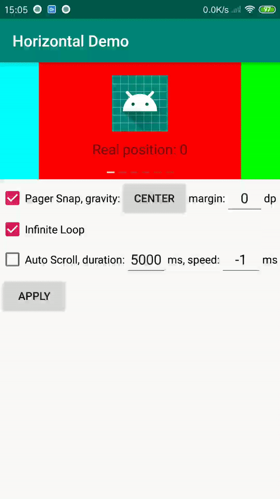
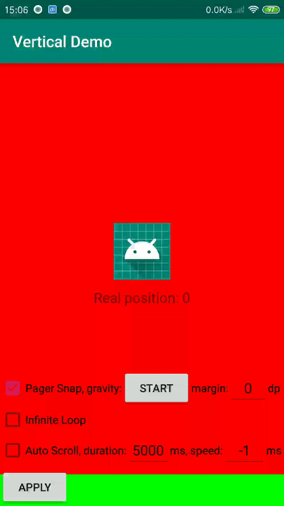

### UltraRecyclerView

[中文文档](README-ch.md)

Project `UltraRecyclerView` is a RecyclerView extension that encapsulates multiple features.

#### Screenshots



#### Main Feature

* support horizontal scrolling and vertical scrolling
* support pager snap. support setting align gravity and margin
* support switching views circularly. For example, if there are 3 views to display in a RecyclerView, it should switch back to the first view after the third view.
* support auto-scrolling feature，implemented timer with Handler.
* BannerView has a built-in indicator. support setting bottom margin, height, inner margin, and width and color of the selected and default status.

you can combine multiple features at the same time.

#### Usage

Please find the latest version(1.0.0 so far) in maven repository. The newest version has been upload to jcenter, make sure you have added at least one of these repositories.

Using Gradle:

```
// gradle
implementation 'com.jimmysun:ultrarecyclerview:1.0.0'
```
or grab via Maven:

```
// pom.xml in maven
<dependency>
	<groupId>com.jimmysun</groupId>
	<artifactId>ultrarecyclerview</artifactId>
	<version>1.0.0</version>
	<type>pom</type>
</dependency>
```

Create your own layout using a UltraRecyclerView:

activity_recycler_view.xml

```xml
<com.jimmysun.ultrarecyclerview.UltraRecyclerView
    android:id="@+id/ultra_recycler_view"
    android:layout_width="match_parent"
    android:layout_height="match_parent"
    app:orientation="vertical"
    app:alignGravity="start"
    app:alignMargin="0dp"
    app:infiniteLoop="true"/>
```

or using a BannerView:

```xml
<com.jimmysun.ultrarecyclerview.BannerView
    android:id="@+id/banner_view"
    android:layout_width="match_parent"
    android:layout_height="150dp"
    app:alignGravity="center"
    app:alignMargin="0dp"
    app:infiniteLoop="true"
    app:indicatorBottomMargin="8dp"
    app:indicatorSelectedColor="#FFFFFFFF"
    app:indicatorDefaultColor="#4D868E9E"
    app:indicatorSelectedWidth="10dp"
    app:indicatorDefaultWidth="10dp"
    app:indicatorHeight="2dp"
    app:indicatorMargin="5dp"
    app:indicatorVisibility="visible"/>
```

You can follow my tutorial below on how to use UltraRecyclerView:

```java
mUltraRecyclerView = findViewById(R.id.ultra_recycler_view);
// initialize MyAdapter, which extends RecyclerView.Adapter
mUltraRecyclerView.setAdapter(new MyAdapter(RecyclerView.VERTICAL));
// set orientation
mUltraRecyclerView.setOrientation(RecyclerView.VERTICAL);
// set pager snap, including align gravity and margin
mUltraRecyclerView.setPagerSnap(Gravity.START, 0);
// set an infinite loop
mUltraRecyclerView.setInfiniteLoop(true);
// start auto-scroll
mUltraRecyclerView.startAutoScroll(2000);
mUltraRecyclerView.setAutoScrollSpeed(500);
```

or use BannerView in java:

```java
mBannerView = findViewById(R.id.banner_view);
// initialize MyAdapter, which extends RecyclerView.Adapter
mBannerView.setAdapter(new MyAdapter(RecyclerView.HORIZONTAL));
// set pager snap
mBannerView.setPagerSnap(Gravity.CENTER);
// set an infinite loop
mBannerView.setInfiniteLoop(true);
// set style of indicator
mBannerView.setIndicatorBottomMargin(24);
mBannerView.setIndicatorSelectedColor(Color.GREEN);
mBannerView.setIndicatorDefaultColor(Color.WHITE);
```

For other API reference,see [this](ATTRIBUTES.md) to read more.

#### FAQ
* How to refresh data? you can refresh data by the below method:
    * ultraRecyclerView.refresh();

#### DEMO

[Demo Project](https://github.com/jimmysuncpt/UltraRecyclerView/tree/master/demo)

#### LICENSE
`UltraRecyclerView` is available under the MIT license.
